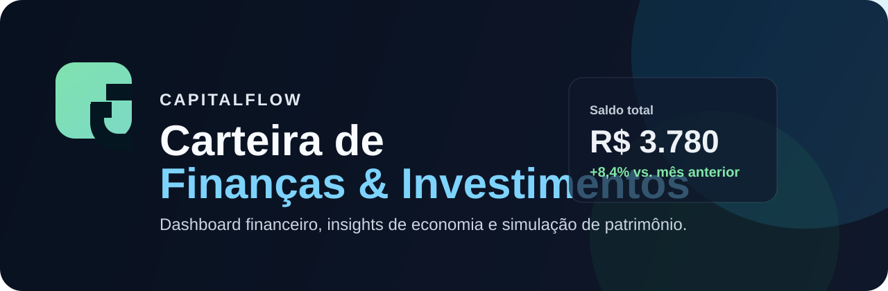

# CapitalFlow

<p align="center">
  
</p>

<p align="center">
  
  
  
  
</p>

Aplicação web moderna de finanças pessoais e investimentos, criada para ajudar usuários a controlar gastos, planejar objetivos e simular crescimento patrimonial com inteligência financeira.

## Demonstração

A aplicação reúne três telas principais:

- Login com visual premium e autenticação visual
- Dashboard de finanças com entradas, saídas e histórico
- Página de investimentos e cálculos de retorno

## Funcionalidades

### Dashboard financeiro
- resumo de saldo total, entradas e saídas;
- cadastro de movimentações com tipo, valor, categoria, descrição e data;
- filtros por mês e categoria;
- histórico de transações com opção de exclusão;
- gráfico de distribuição de gastos por categoria;
- insights automáticos para economia e otimização de despesas.

### Investimentos
- recomendações por categoria: ações, ETFs, FIIs e renda fixa;
- classificação por nível de risco;
- rentabilidade estimada;
- justificativa por ativo para suporte de decisão;
- calculadora de projeção de patrimônio com juros compostos.

## Design e experiência

- interface premium em tema escuro;
- visual moderno com glassmorphism e cards financeiros;
- responsividade para desktop e mobile;
- paleta focada em verde, azul e cinza sofisticado.

## Stack

- React
- Vite
- JavaScript

## Pré-requisitos

- Node.js 18+
- npm

## Como executar localmente

1. Clone o repositório:

```bash
git clone https://github.com/senna1994/carteira-financas.git
cd carteira-financas
```

2. Instale as dependências:

```bash
npm install
```

3. Inicie o projeto:

```bash
npm run dev -- --host 0.0.0.0
```

4. Acesse no navegador:

```text
http://localhost:5173/
```

## Build para produção

```bash
npm run build
```

## Estrutura do projeto

```text
carteira-financas/
├── public/
│   └── capitalflow-banner.svg
├── src/
│   ├── App.css
│   ├── App.jsx
│   ├── index.css
│   └── main.jsx
├── .gitignore
├── index.html
├── package.json
├── README.md
├── vite.config.js
└── package-lock.json
```

## Objetivo do projeto

Este projeto foi desenvolvido como uma solução de estudo e portfólio para demonstrar habilidades em:

- interface moderna e responsiva;
- UX/UI para aplicações financeiras;
- lógica de dashboard e análise de dados;
- cálculos de projeção financeira e investimento.

## Licença

Projeto para fins educacionais e de apresentação em portfólio.
